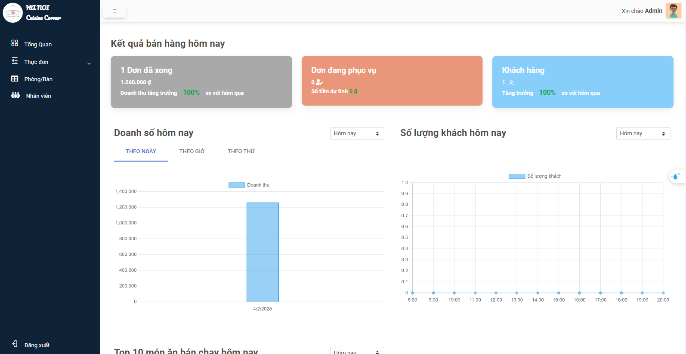
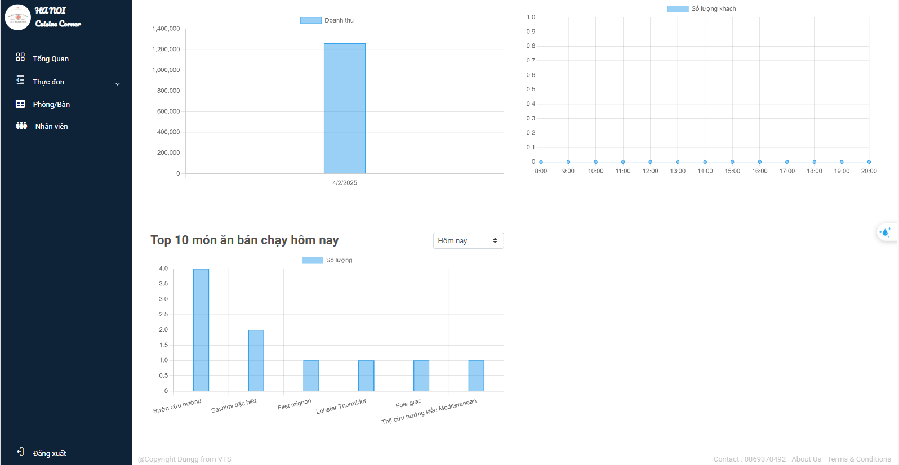
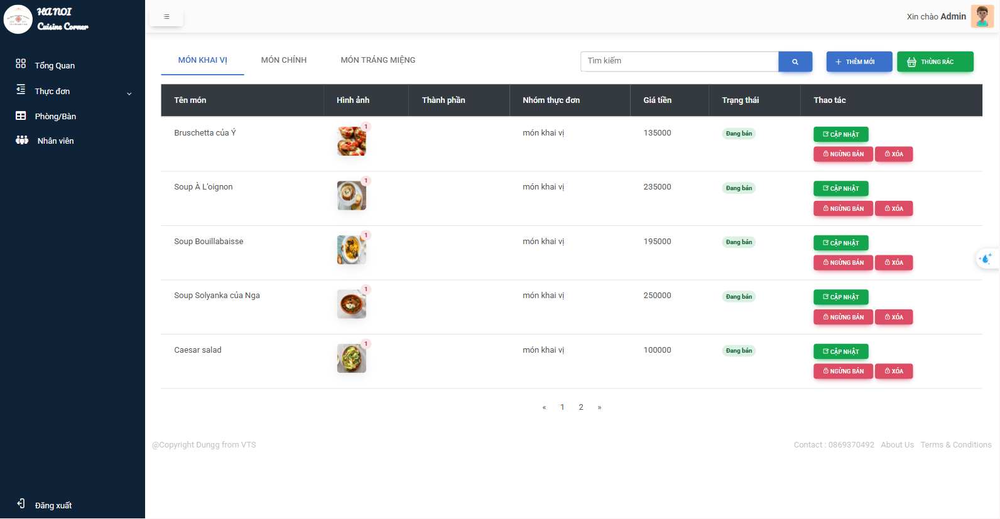
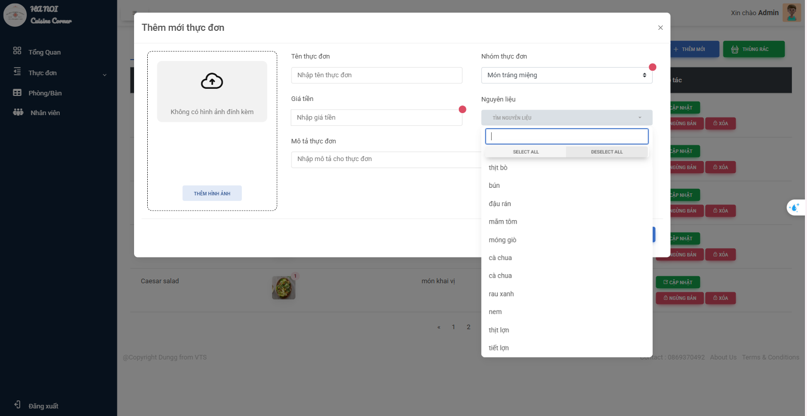
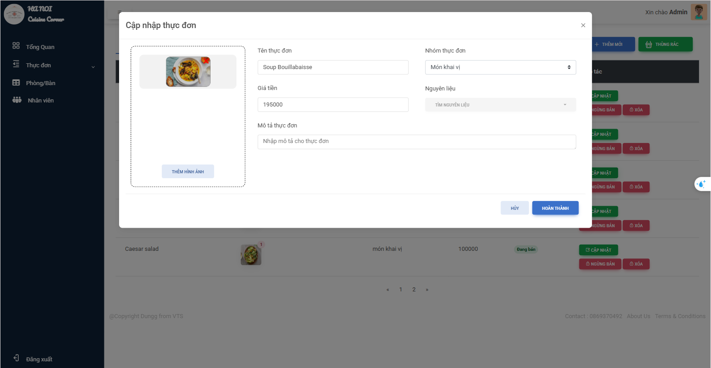
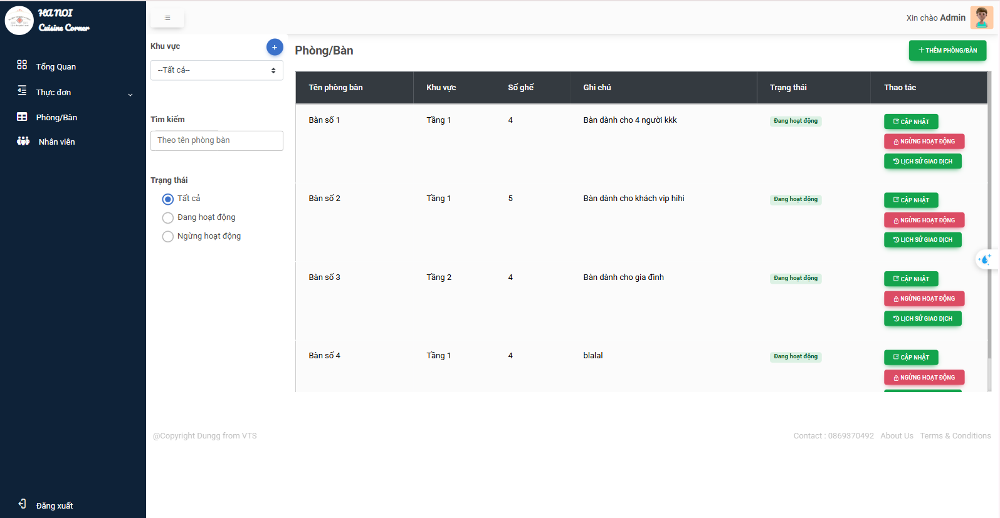
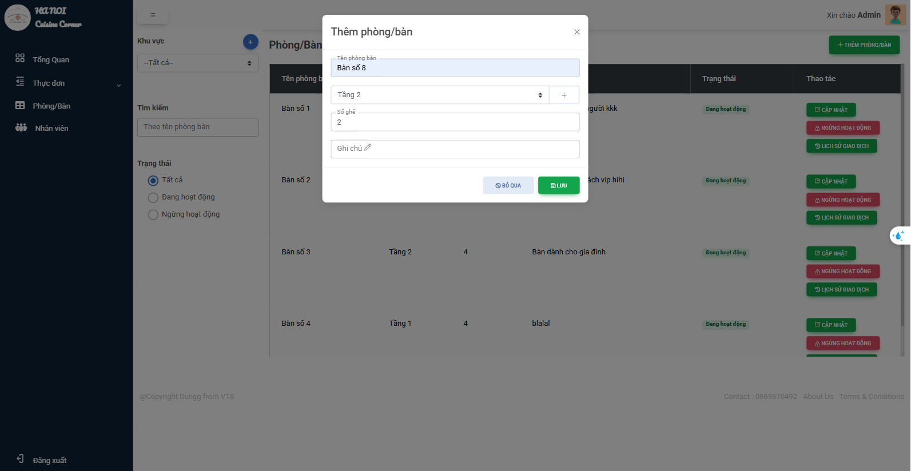
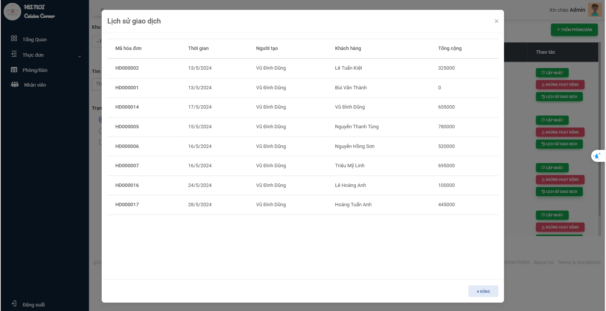
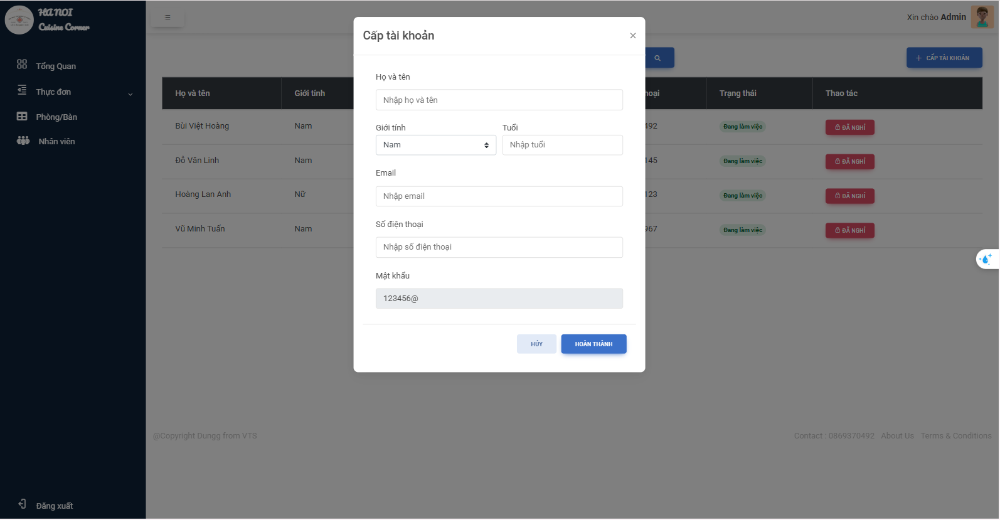

# Introduce

Website admin allows viewing statistics about business situation. In addition, admin can manage information such as menu, tables, staff

# Overview

- #### Dashboard 

- #### Menu Management 
Admin can CRUD menu

- #### Table Management 

Add new Table

Show history

- #### Provide accounts to employees

Employees can change their password after the account is created.

